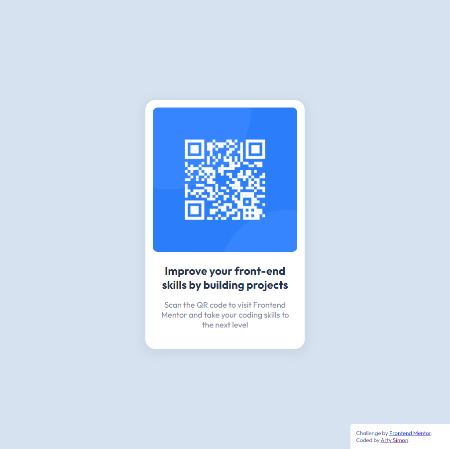

# Frontend Mentor - QR code component solution

This is a solution to the [QR code component challenge on Frontend Mentor](https://www.frontendmentor.io/challenges/qr-code-component-iux_sIO_H). Frontend Mentor challenges help you improve your coding skills by building realistic projects.

## Table of contents

- [Overview](#overview)
  - [Screenshot](#screenshot)
  - [Links](#links)
- [My process](#my-process)
  - [Built with](#built-with)
  - [What I learned](#what-i-learned)
  - [Continued development](#continued-development)
  - [Useful resources](#useful-resources)
- [Author](#author)

**Note: Delete this note and update the table of contents based on what sections you keep.**

## Overview

### Screenshot



### Links

- Solution URL: [https://github.com/artimys/qr-code-component](https://github.com/artimys/qr-code-component)
- Live Site URL: [https://artimys-qr-code-component.netlify.app](https://artimys-qr-code-component.netlify.app/)


## My process

### Built with

- npm / Gulp 4
```
# for local development:
# generate css file to _site and start browser sync,
# will auto open _site/index.html in browser at localhost:3000
#
gulp watch

# for netlify: auto generate css for deployment
#
gulp build
```
- Mobile-first workflow
- CSS custom properties
- Flexbox


### What I learned

- NPM / Gulp 4
- [Netlify](https://www.netlify.com/)

### Continued development

- Future to convert this to a React component.

### Useful resources

- [Youtube: Kevin Powell's Sass and BrowserSync basic setup](https://www.youtube.com/watch?v=QgMQeLymAdU&list=PLEj3XJWjdcsIIFqAAD81lEO1rumJkQsJT&index=2)
- [Gulp 4 walktrough detail](https://coder-coder.com/gulp-4-walk-through/) for extra gulp plugins and setup


## Author

- Frontend Mentor - [@artimys](https://www.frontendmentor.io/profile/artimys)

